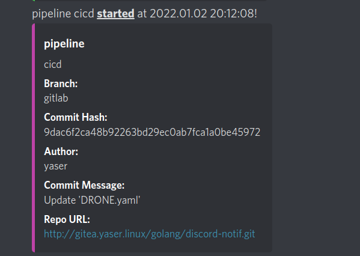
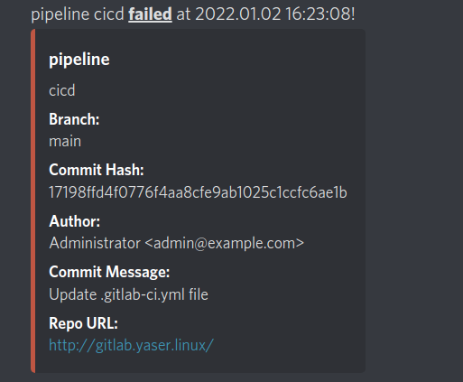
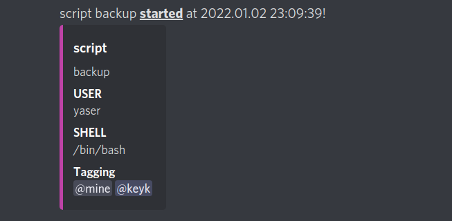

# discord-notif
Send notifications to discord in Your pipelines or scripts  

## install
```BASH
# build
make

# build and move to /usr/local/bin
make install

# build docker image
make docker

```
## Tag Users in Notifications
in discord get your User or Role id by typing `\@username` or `\@rolename` and for users just copy digits between `<>` and for roles copy `&digits` between `<>`, then run `discord-notif` set them like:
```BASH
DISCORD_TAGS='&896806629814347826,513283330966055177' discord-notif cicd pipeline start
```

## help
```
discord-notif <name> <kind> <state>
state:
        error   It will exit with exit status code 1.
        start   just notify on starting
        succeed just notify on succeed
kind:
        pipeline  Use within your Gitlab CI or Drone pipeline
        script    Use in Your scripts
environment variables:
        DISCORD_URL       Your discord bot API URL
        DISCORD_TAGS      Comma seperated list of user/role ids to tag in notifications
        DISCORD_USERNAME  Username for Bot(Optional, default is 'Notification')
        DISCORD_AVATAR    Your discord bot avatar URL(Optional, default is a 'Sad PEPE')
        NOTIF_TAGS        Comma seperated list of environments to use in templating notifications
                          For Drone CI: https://docs.drone.io/pipeline/environment/reference
                            if the variable name is DRONE_COMMIT_AUTHOR, use it like DroneCommitAuthor
                          For Gitlab CI: https://docs.gitlab.com/ee/ci/variables/predefined_variables.html
                            if the variable name is GITLAB_USER_ID, use it like GitlabUserId
                          For scripts: only works when kind is 'script'
                            list what You want to see in template like NOTIF_TAGS='USER,HOSTNAME'
                          If This variable is not set, for each mode There is a default template and it will be used
examples:
pipeline -> NOTIF_FIELDS="DroneCommitAuthor,DroneCommit" discord-notif project1 pipeline start
script -> DISCORD_TAGS='11111111111111,22222222222222,&333333333333' NOTIF_FIELDS="USER,HOSTNAME,SHELL" discord-notif backup-mysql script succeed
```

# Notification Examples
Drone default template

Gitlab default template

Script default template

